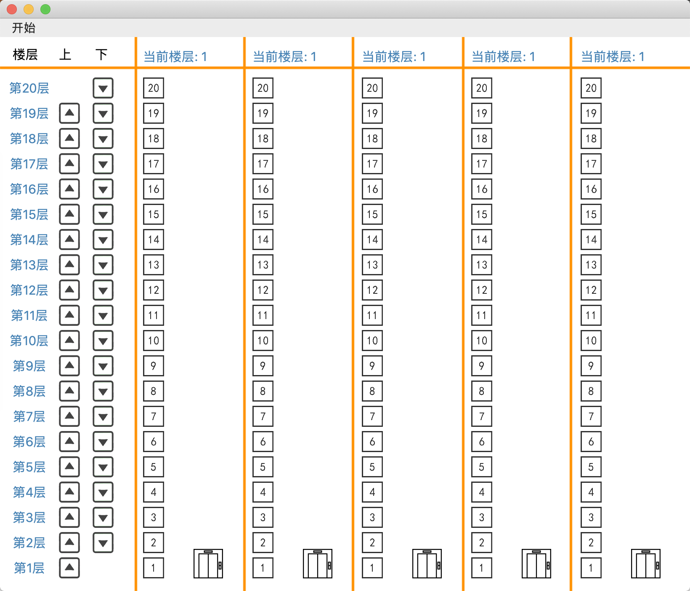
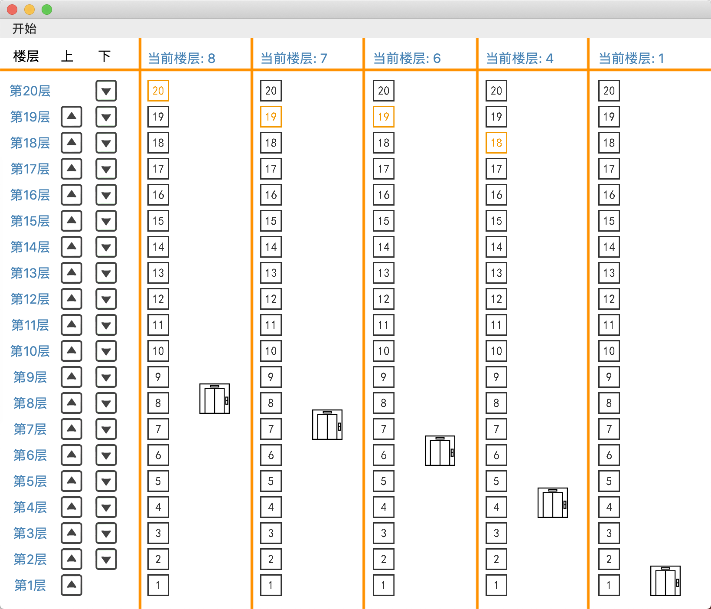
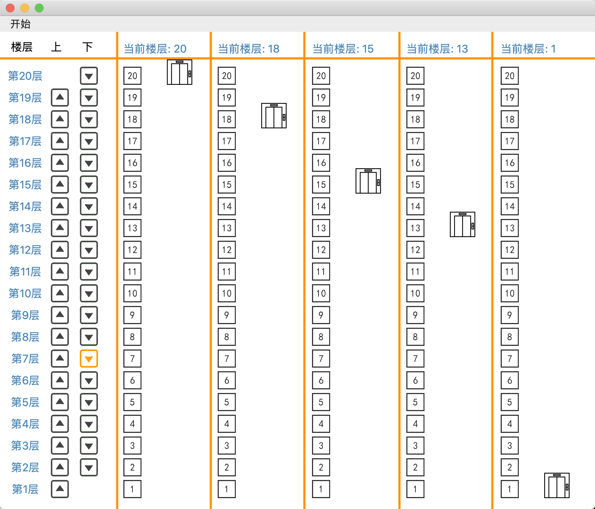
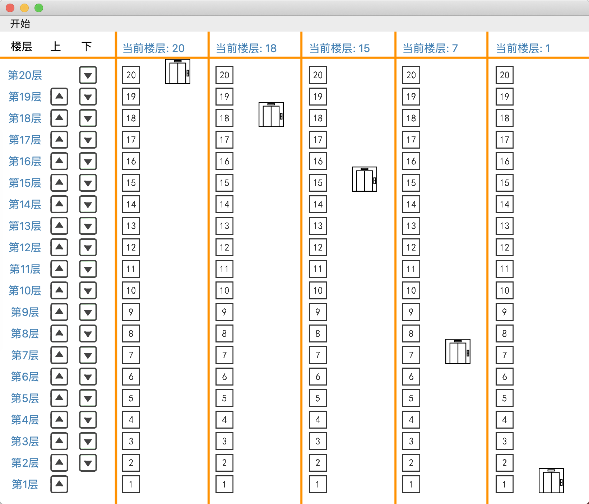

# Elevator Dispatch Simulator

## 1 项目背景

该项目是同济大学软件学院2020年操作系统课中的作业之一

目的是为了更加深入且直观的掌握电梯调度算法及相关算法的原理

该项目使用`PyQt5`开发


## 2 使用说明

Windows平台请双击 **Elevator Simulator.exe**，略有卡顿请耐心等待

macOS平台请双击**Elevator Simulator.app**，首次打开会有闪退情况，再次打开（或耐心等待）即可正常使用




- 最左侧为楼层号与各个楼层的上下行键，然后为五部电梯，每部电梯1-20代表电梯内的按键。每部电梯上方实时显示电梯当前楼层
- 如果想在某一层乘电梯上（下）行，则点击最左方对应楼层上（下）按钮
- 如果乘坐某部电梯到达指定层数，则在该电梯内点击对应楼层按钮
- 可以从“开始”菜单退出，或使用快捷键Ctrl+Q(Command+Q)退出


## 3 算法

### 3.1 最短寻道时间优先

让离当前磁道最近的请求访问者启动，即是让查找时间最短的那个作业先执行，而不考虑请求访问者到来的先后次序，这样就克服了先来先服务调度算法中磁臂移动过大的问题。

最短寻找楼层时间优先算法选择下一个服务对象的原则是最短寻找楼层的时间。这样请求队列中距当前能够最先到达的楼层的请求信号就是下一个服务对象。在重载荷的情况下，最短寻找楼层时间优先算法的平均响应时间较短，但响应时间的方差较大，原因是队列中的某些请求可能长时间得不到响应，出现所谓的“饿死”现象。

### 3.2 电梯调度算法（扫描算法）

扫描算法不仅考虑到欲访问的磁道与当前磁道的距离，更优先考虑的是磁头的当前移动方向。当磁头正在由里向外移动时，扫描算法所选择的下一个访问对象应是其欲访问的磁道，既在当前磁道之外，又是距离最近的。这样由里向外地访问，直至再无更外的磁道需要访问时，才将磁臂换向，由外向里移动。这时，同样也是每次选择在当前磁道之内，且距离最近的进程来调度。

扫描算法按照楼层顺序依次服务请求，它让电梯在最底层和最顶层之间连续往返运行，在运行过程中响应处在于电梯运行方向相同的各楼层上的请求。它进行寻找楼层的优化，效率比较高，但它是一个非实时算法。扫描算法较好地解决了电梯移动的问题，在这个算法中，每个电梯响应乘客请求使乘客获得服务的次序是由其发出请求的乘客的位置与当前电梯位置之间的距离来决定的。所有的与电梯运行方向相同的乘客的请求在一次电向上运行或向下运行的过程中完成，免去了电梯频繁的来回移动。

### 3.3 LOOK算法

电梯在最底层和最顶层之间运行，当 LOOK 算法发现电梯所移动的方向上不再有请求时立即改变运行方向，而扫描算法则需要移动到最底层或者最顶层时才改变运行方向。

### 3.4 多部电梯调度

在前面三种算法的基础上，对于每部电梯，设计各自上下行数组，其中上行数组正序排列，下行数组逆序排列，电梯根据目前状态以及两数组中内容执行动作。

当某楼层有上行或下行请求发出时，先考虑每部电梯在完成当前序列的过程中能否响应该请求，计算出符合此条件的电梯的响应距离，再考虑剩余电梯从其当前位置到序列终点与终点到该请求位置的响应距离之和，最后比较每部电梯的响应距离，将该请求分配给具有最短响应距离一部电梯。


## 4 实现

### 4.1 电梯调度类Evaluate()

|    类内成员     |                       说明                       |
| :-------------: | :----------------------------------------------: |
|     goingUp     |          标志着电梯正在向上，是一个集合          |
|    goingDown    |          标志着电梯正在向下，是一个集合          |
|  lastTimeRise   |            标志电梯上一次是上行的状态            |
|  lastTimeDrop   |            标志电梯上一次是下行的状态            |
|    location     |                 当前电梯在的楼层                 |
|  unprocessedUp  | 记录着某电梯将要进行但是还没有开始进行的上升请求 |
| unprocessedDown | 记录着某电梯将要进行但是还没有开始进行的下降请求 |
| seqRise.append  |            存放电梯中向上的序列的列表            |
| seqDrop.append  |            存放电梯中向下的序列的列表            |

### 4.2 楼层内按钮监听

- 定义方法用于监听电梯楼层中的数字按钮，传入的参数分别为quickestElevator，buttonSelection，其中，quickestElevator代表了最快到达的电梯序号，buttonSelection代表了电梯中被按到的楼层号
- ​	电梯在静止状态时，请求在下方加入下行序列，在上方加入下行序列，否则不做响应
- ​	电梯在上行状态时，请求在上方加入下行序列，否则不做响应
- ​	电梯在下行状态时，请求在下方加入下行序列，否则不做响应

```python
    def numButtonListner(self, quickestElevator, buttonSelection):
        if self.goingUp[quickestElevator] == False and self.goingDown[quickestElevator] == False:
            if self.location[quickestElevator] > buttonSelection:
                self.ui.numBtn[quickestElevator][buttonSelection].setStyleSheet(
                    "QPushButton{border-image: url(res/" + str(buttonSelection) + "_pressed.png)}")
                self.seqDrop[quickestElevator].append(buttonSelection)
                self.seqDrop[quickestElevator] = list(set(self.seqDrop[quickestElevator]))
                self.seqDrop[quickestElevator].sort()
                self.seqDrop[quickestElevator].reverse()
            if self.location[quickestElevator] < buttonSelection:
                self.ui.numBtn[quickestElevator][buttonSelection].setStyleSheet(
                    "QPushButton{border-image: url(res/" + str(buttonSelection) + "_pressed.png)}")
                self.seqRise[quickestElevator].append(buttonSelection)
                self.seqRise[quickestElevator] = list(set(self.seqRise[quickestElevator]))
                self.seqRise[quickestElevator].sort()

        elif self.goingUp[quickestElevator] == True and self.goingDown[quickestElevator] == False:
            if self.location[quickestElevator] < buttonSelection:
                self.ui.numBtn[quickestElevator][buttonSelection].setStyleSheet(
                    "QPushButton{border-image: url(res/" + str(buttonSelection) + "_pressed.png)}")
                self.seqRise[quickestElevator].append(buttonSelection)
                self.seqRise[quickestElevator] = list(set(self.seqRise[quickestElevator]))
                self.seqRise[quickestElevator].sort()

        elif self.goingUp[quickestElevator] == False and self.goingDown[quickestElevator] == True:
            if self.location[quickestElevator] > buttonSelection:
                self.ui.numBtn[quickestElevator][buttonSelection].setStyleSheet(
                    "QPushButton{border-image: url(res/" + str(buttonSelection) + "_pressed.png)}")
                self.seqDrop[quickestElevator].append(buttonSelection)
                self.seqDrop[quickestElevator] = list(set(self.seqDrop[quickestElevator]))
                self.seqDrop[quickestElevator].sort()
                self.seqDrop[quickestElevator].reverse()

        else:
            print("error")
```

### 4.3 上下按钮的监听

- RisingDistance中记录着发出上升请求时当有一层楼的按钮被按后，此时所有的电梯都开始计算自己的距离，初始化为30
- fallingDistance中记录着发出下降请求时当有一层楼的按钮被按后，此时所有的电梯都开始计算自己的距离，初始化为30
- upRequest中记录着被按的楼层是否在电梯当前位置的上方或者是本层
- downRequest中记录着被按的楼层是否在电梯当前位置的下方或者是本层
- 当某楼层有上行或下行请求发出时，先考虑每部电梯在完成当前序列的过程中能否响应该请求，计算出符合此条件的电梯的响应距离，再考虑
- 剩余电梯从其当前位置到序列终点与终点到该请求位置的响应距离之和，最后比较每部电梯的响应距离，将该请求分配给具有最短响应距离一部电梯

```python
i = 1
        while i < 6:
            if self.goingUp[i] == True:
                if upRequest[i]:
                    RisingDistance[i] = abs(buttonSelection - self.location[i])
                else:
                    RisingDistance[i] = abs(self.location[i] - self.seqRise[i][len(self.seqRise[i]) - 1]) \
                                        + abs(
                        buttonSelection - self.seqRise[i][len(self.seqRise[i]) - 1])  # 当前位置距终点距离 + 终点距请求位置距离

            elif self.goingUp[i] == False and self.goingDown[i] == False:
                RisingDistance[i] = abs(buttonSelection - self.location[i])

            elif self.goingDown[i] == True:
                RisingDistance[i] = abs(self.location[i] - self.seqDrop[i][len(self.seqDrop[i]) - 1]) \
                                    + abs(
                    buttonSelection - self.seqDrop[i][len(self.seqDrop[i]) - 1])  # 当前位置距终点距离 + 终点距请求位置距离

            i += 1
        quickestElevator = RisingDistance.index(min(RisingDistance))  # 最快到达的电梯的序号

        if self.goingUp[quickestElevator] == True:
            if upRequest[quickestElevator]:
                self.seqRise[quickestElevator].append(buttonSelection)
                self.seqRise[quickestElevator] = list(set(self.seqRise[quickestElevator]))
                self.seqRise[quickestElevator].sort() # 对发出请求的楼层进行排序
            else:
                self.unprocessedUp[quickestElevator][buttonSelection] = 1

        elif self.goingUp[quickestElevator] == False and self.goingDown[quickestElevator] == False:
            if upRequest[quickestElevator]:
                self.seqRise[quickestElevator].append(buttonSelection)
                self.seqRise[quickestElevator] = list(set(self.seqRise[quickestElevator]))
                self.seqRise[quickestElevator].sort() # 对发出请求的楼层进行排序
            else:
                self.seqDrop[quickestElevator] = list(set(self.seqDrop[quickestElevator]))
                self.seqDrop[quickestElevator].sort()
                self.seqDrop[quickestElevator].reverse()  # 对发出请求的楼层进行逆序
                self.unprocessedUp[quickestElevator][buttonSelection] = 1

        elif self.goingDown[quickestElevator] == True:
            self.unprocessedUp[quickestElevator][buttonSelection] = 1
```

下行同理


## 5 测试展示

### 5.1 测试电梯内按键监听

- ​	测试用例：在任意情况下按下电梯内按键。

- ​	预期结果：电梯正常响应。

- ​	实际结果：电梯正常响应。

  

### 5.2 测试上下按钮

- ​	测试用例：任意状态下，按下某层上（下）按钮。

- ​	预期结果：距离该层最近的电梯运行。

- ​	实际结果：同上。

  下图按下7层下行按钮，距离最近的四号电梯运行。



